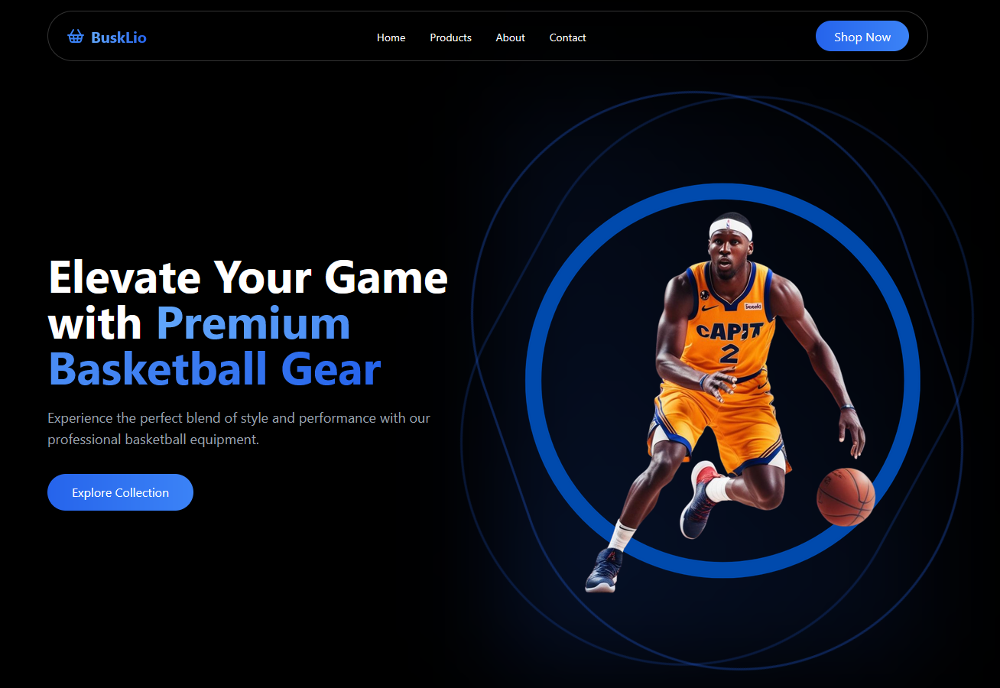

# BuskLio - Premium Basketball Equipment Landing Page

BuskLio is a modern, responsive landing page for a premium basketball equipment company. Built with Next.js and React, it showcases various sections to highlight products, features, and engage potential customers.

## Features

- Responsive design for all device sizes
- Interactive UI elements with smooth animations
- Product showcase with hover effects
- Testimonials from professional athletes
- FAQ section with expandable answers
- Contact form with validation
- Newsletter subscription
- Smooth scrolling navigation

## Technologies Used

- [Next.js](https://nextjs.org/) - React framework for production
- [React](https://reactjs.org/) - JavaScript library for building user interfaces
- [TypeScript](https://www.typescriptlang.org/) - Typed superset of JavaScript
- [Tailwind CSS](https://tailwindcss.com/) - Utility-first CSS framework
- [Framer Motion](https://www.framer.com/motion/) - Animation library for React
- [Lucide React](https://lucide.dev/) - Icon set for React
- [Shadcn UI](https://ui.shadcn.com/) - UI component library

## Getting Started

### Prerequisites

- Node.js (v14 or later)
- npm or yarn

### Installation

1. Clone the repository:
